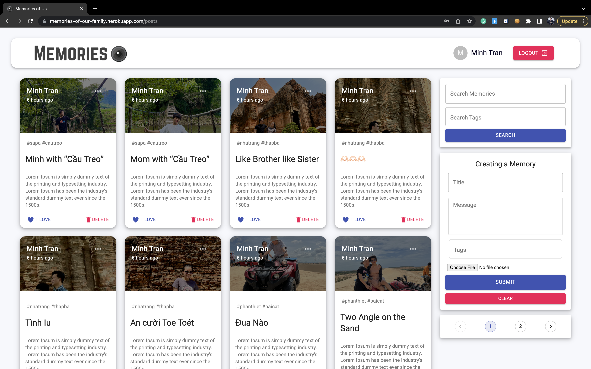
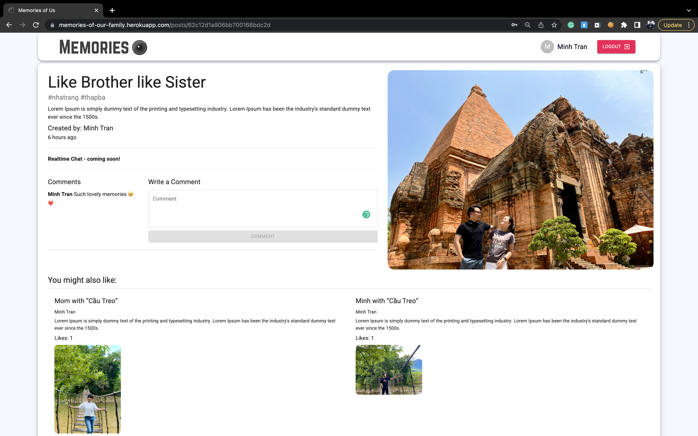
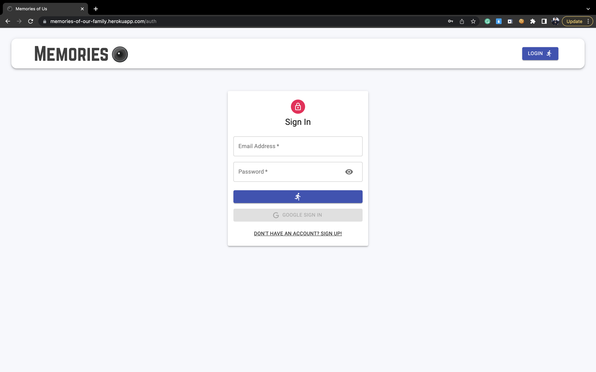
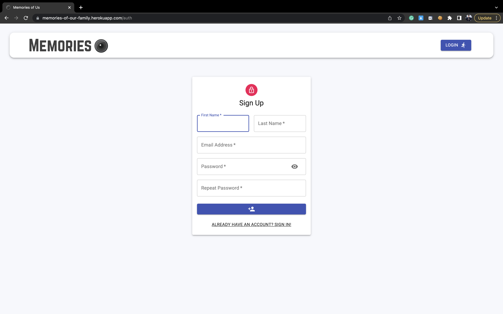
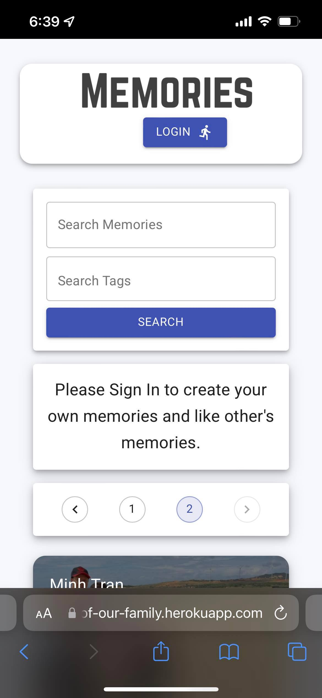
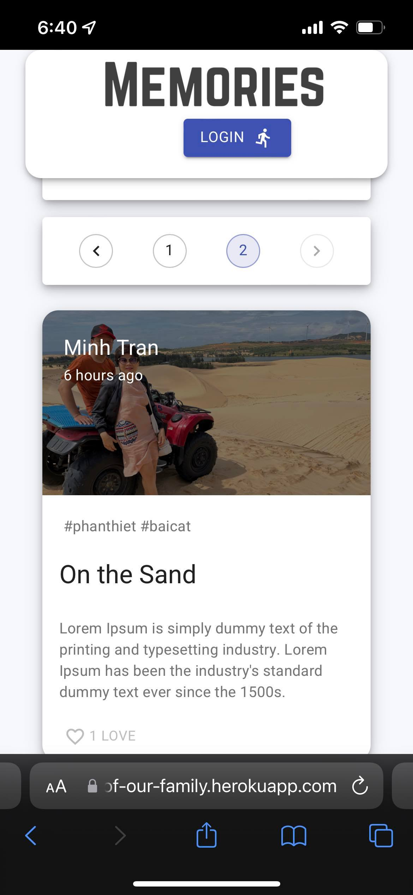

<h1>📷 Memories 📸</h1>

### ✅ Memories (MERN Full-Stack App)

### _Memories Applciation, where Users can add, delete, update and like memories, and View each other's memories !!_
### _I created Memories for my family as a gift for us to store our happy memories 👨‍👩‍👧‍👦_

### Link :link: https://memories-of-us.netlify.app/

### Backend Deployed at: :link: https://memories-family-api.herokuapp.com/

## Desktop Interface 🖥

## Mobile Interface 📱

## Run Locally

-   Run this command `git clone https://github.com/minhtran241/memories-of-our-family.git`
-   You are now in the dev environment and you can play around

## Features

-   Authentication (Login/Signup) and with (Google)
-   Create and Update Memories
-   Like and Delete Memories
-   View Other user's memories
-   Recommended Posts
-   Mobile Responsive
-   Open Source (Tweak it and use it) :)
-   Pagination
-   Validation

## Tech Stack

-   HTML5
-   CSS3
-   Javascript and ES+6
-   Material-UI
-   ReactJs
-   Redux, Redux-Thunk
-   NodeJs
-   ExpressJs
-   MongoDB Atlas

## Packages

-   Frontend
-   -   axios
-   -   moment
-   -   redux
-   -   redux-thunk
-   -   @material-ui/core
-   -   @material-ui/icons
-   -   material-ui-chip-input
-   -   @material-ui/lab
-   -   react-file-base64
-   -   react-google-login (for google login feature)
-   -   jwt-decode (web tokens decoding)

-   Backend
-   -   express
-   -   mongoose (for managing mongoDB)
-   -   cors
-   -   dotenv (for environment variables)
-   -   body-parser
-   -   nodemon
-   -   bcryptjs (for password hashing)
-   -   jsonwebtoken (for web tokens and sessions)
